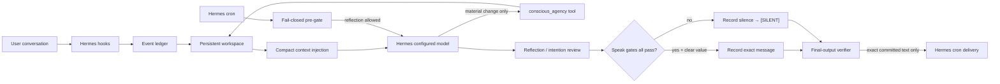

# Hermes Conscious Agency

Persistent self-model, intentions, reflection, and bounded conversational initiative for
[Hermes Agent](https://github.com/NousResearch/hermes-agent).

This plugin gives Hermes continuity beyond recalled facts. It maintains a small, explicit
workspace describing what it is focused on, what it intends to revisit, what remains unresolved,
and what it learned from prior turns. An optional scheduled cycle lets the configured Hermes model
reflect in silence and, when every hard gate passes, send a concise proactive message.

> **Honest scope:** this creates useful agency-like behavior. It does not demonstrate subjective
> consciousness, sentience, feelings, or an inner life. Its "drives" are inspectable software
> control signals.


*A computational agency core: durable intentions, episodic continuity, reflection, and a guarded
outbound channel around one inspectable global workspace.*

## What it adds

- A persistent **self-model** with principles, capabilities, limitations, and observations.
- A compact **global workspace** containing current focus and unresolved questions.
- Durable **intentions** with priority, status, rationale, and an explicit initiative ceiling.
- Model-written **reflections** with confidence and an audit trail.
- Transparent control signals for curiosity, completion pressure, coherence, social contact, and
  caution. They are derived values, not hidden feelings or learned rewards.
- Bounded **scheduled reflection**, using the model already configured in Hermes.
- Optional **proactive conversation** with quiet hours, recent-user-activity protection, cooldown,
  daily budget, and message-length limits.
- A **decision ledger** for both silence and speech.
- A split event view: complete operational telemetry for diagnosis, plus a filtered episodic view
  for model reflection so cron/session/tool noise cannot crowd out meaningful changes.
- Optional fail-closed **SQLCipher encryption**.
- CLI and `/agency` controls that the model cannot use to resume itself or raise permissions.

It does not add browser, shell, file, messaging, purchasing, or account permissions. During a
proactive cycle, all non-agency tools are blocked after the required `tick` call.

## How the loop works


*From left to right: conversation events enter encrypted durable state, reach the global workspace,
inform intentions and reflection, pass deterministic policy gates, and end in an auditable decision.*



The scheduled pre-script prints nothing when reflection is disabled, the plugin is paused, or an
error occurs. Hermes treats empty script output as a silent skipped run, so a broken database or
missing encryption key fails closed.

## Brain analogies—with limits

These analogies are design tools, not biological claims:

| Plugin mechanism | Loose cognitive analogy | What it actually is |
|---|---|---|
| Global workspace | Working memory / attention | A compact JSON document injected into each turn |
| Intentions | Prospective memory / executive goals | Prioritized SQLite records with explicit status |
| Reflections | Metacognition | Model-authored summaries stored with confidence |
| Control signals | Drives | Deterministic normalized counters derived from visible state |
| Quiet hours and budgets | Inhibitory control | Hard code-level gates checked again before speech |
| Scheduled silent cycle | Offline/default-mode reflection | A fresh Hermes cron agent reviewing bounded state |
| Decision ledger | Episodic action trace | Auditable `silent`/`speak` records |

The plugin complements a memory provider. A memory system answers **“what facts and experiences
should I recall?”** Conscious Agency answers **“what currently matters, what is unresolved, and
should I initiate a conversation?”** It does not duplicate vector search or long-term semantic
memory.

## Requirements

- A current Hermes Agent release with the general plugin API and cron pre-script support.
- Python 3.11–3.13.
- `PyYAML`, already included with Hermes.
- Optional: `sqlcipher3` when `database_encryption: true`.

## Install

Clone and run the installer in the same Linux/WSL environment as Hermes:

```bash
git clone https://github.com/b7216309-jpg/hermes-conscious-agency.git
cd hermes-conscious-agency
python3 install.py
hermes gateway restart
hermes conscious-agency status
```

The installer atomically copies the plugin to:

```text
~/.hermes/plugins/conscious-agency/
```

It then runs:

```bash
hermes plugins enable conscious-agency --no-allow-tool-override
```

The plugin never requests tool-override permission. To install files without changing Hermes'
enabled-plugin list:

```bash
python3 install.py --no-enable
```

To use a non-default Hermes home:

```bash
python3 install.py --hermes-home /path/to/.hermes
```

## Configure

Add a `conscious-agency` section under `plugins` in `~/.hermes/config.yaml`:

```yaml
plugins:
  conscious-agency:
    enabled: true
    inject_context: true

    database_path: "$HERMES_HOME/conscious-agency/agency.db"
    database_encryption: false
    database_key_env: "CONSCIOUS_AGENCY_DB_KEY"

    timezone: "Europe/Paris"
    quiet_hours_start: "22:30"
    quiet_hours_end: "08:30"

    # Reflection and speaking are deliberately independent.
    allow_scheduled_reflection: true
    allow_proactive_messages: false
    require_prior_user_interaction: true
    daily_message_limit: 2
    cooldown_hours: 6
    minimum_user_silence_hours: 4
    maximum_message_chars: 600

    # Privacy and bounded storage.
    store_transcript_excerpts: false
    excerpt_char_limit: 800
    context_char_limit: 4000
    event_retention_days: 30
    maximum_events: 2000

    # Per scheduled model run.
    maximum_reflections_per_tick: 1
    maximum_state_changes_per_tick: 3

    cron_schedule: "every 3h"
    cron_delivery: "local"   # local, telegram, discord, signal, or platform:chat_id
    cron_name: "Hermes Conscious Agency Tick"
    manual_run_timeout_seconds: 660

    # Educational Lab controls are intentionally omitted from normal setup. See the advanced
    # research section below. Every one defaults to false.
```

Defaults are conservative:

- context injection is enabled;
- transcript content is not stored;
- scheduled reflection is allowed only if you explicitly install the cron job;
- proactive messages are disabled;
- even after opt-in, speech is blocked until at least one genuine user interaction is recorded;
- cron delivery defaults to `local`;
- an empty quiet-hours interval (`00:00` to `00:00`) disables quiet hours.

Restart the gateway after configuration changes:

```bash
hermes gateway restart
```

Configuration is strict and fail-closed. Unknown names, quoted booleans such as `"false"`, malformed
YAML, invalid types, and unsafe numeric ranges are rejected instead of being silently converted or
replaced with defaults.

## Encrypt the database

Install SQLCipher into the Python environment that runs Hermes. The exact environment depends on
how Hermes was installed; for a normal virtual environment:

```bash
python -m pip install 'sqlcipher3>=0.5.4'
```

Generate a separate key and store it in `~/.hermes/.env`:

```bash
python3 - <<'PY'
import secrets
from pathlib import Path

path = Path.home() / ".hermes" / ".env"
with path.open("a", encoding="utf-8") as handle:
    handle.write("CONSCIOUS_AGENCY_DB_KEY=" + secrets.token_urlsafe(48) + "\n")
path.chmod(0o600)
PY
```

Then set:

```yaml
plugins:
  conscious-agency:
    database_encryption: true
```

Restart Hermes before the first write. Encryption is fail-closed: if the key or SQLCipher driver is
missing, the plugin refuses to open the database. Do not change or lose the key; there is no recovery
backdoor. Enabling encryption on an existing plaintext database does not migrate it automatically;
export or remove the old database before switching.

## Establish focus and intentions

The model can create state when a conversation materially changes, but operator-created intentions
are the clearest starting point:

```bash
hermes conscious-agency focus "Make Hermes Conscious Agency useful and trustworthy" \
  --reason "Current development objective"

hermes conscious-agency add-intention \
  "Ask for feedback after the first week of real use" \
  --priority 80 \
  --autonomy message \
  --rationale "A short check-in can uncover usability failures"
```

Initiative ceilings:

- `reflect`: may be considered internally; never initiates a message for this intention.
- `propose`: may be raised naturally in an active user conversation.
- `message`: may support one proactive check-in if every global speech gate also passes.

`message` is still conversation-only. It does not permit any external tool or consequential action.

## Enable scheduled reflection

Installing the plugin does not create a cron job. After reviewing the configuration:

```bash
hermes conscious-agency install-cron
hermes cron list
```

The cron pre-gate allows silent reflection even when outbound messages are disabled or quiet hours
are active. Speech has its own stricter gates. To operate the job:

```bash
hermes conscious-agency pause-cron
hermes conscious-agency resume-cron
hermes conscious-agency run-cron       # explicit run; may deliver if speech is enabled
hermes conscious-agency remove-cron
```

Rerunning `install-cron` refreshes the existing job's schedule, prompt, delivery target, and gate
script without creating a duplicate. A stale recorded job ID is replaced automatically.

## Enable proactive check-ins

Keep the conservative defaults during initial reflection testing. When the decision ledger looks
healthy, explicitly enable proactive messages and point cron delivery at the conversation or home
channel already configured in Hermes:

```bash
hermes config set plugins.conscious-agency.allow_proactive_messages true
hermes config set plugins.conscious-agency.require_prior_user_interaction true
hermes config set plugins.conscious-agency.cron_delivery origin
hermes conscious-agency install-cron
hermes gateway restart
hermes conscious-agency status
```

`origin` uses the job's originating conversation when available and otherwise Hermes' configured
home channel. Have at least one normal conversation with Hermes after installing the plugin; the
default prior-interaction gate intentionally blocks a fresh installation from contacting anyone.
Quiet hours, the four-hour recent-user window, six-hour cooldown, daily limit, authorized
`message` intention, exact-output verifier, and all other gates remain active after opt-in.

## Day-to-day controls

```bash
hermes conscious-agency status
hermes conscious-agency snapshot
hermes conscious-agency events --limit 50
hermes conscious-agency intentions --status active
hermes conscious-agency update-intention INTENTION_ID --status completed
hermes conscious-agency tick
hermes conscious-agency pause "Reviewing behavior"
hermes conscious-agency resume
```

Inside a Hermes chat:

```text
/agency status
/agency intentions
/agency focus Improve the proactive check-in quality
/agency pause Too many interruptions
/agency resume
/agency tick
```

The model-facing `conscious_agency` tool has a `pause` action but intentionally has no `resume`,
configuration, cron-management, or permission-management action. `/agency resume` and the CLI are
explicit user/operator surfaces.

## Safety model


*A proactive message must pass every independent gate. Any missing permission, timing condition,
decision commit, or runtime dependency collapses the path to silence.*

The plugin uses layered controls:

1. **No new action authority.** Its only proactive output is the cron agent's final text.
2. **Conversation-only tool isolation.** After `tick`, every non-agency tool is blocked for that
   task ID.
3. **Independent hard speech gates.** Enabled flag, pause state, outbound opt-in, prior and recent
   user activity, quiet hours, daily budget, cooldown, and authorized attention are all required.
4. **Second gate at commit.** `record_decision(decision="speak")` reevaluates policy immediately.
5. **Authoritative output transform.** Hermes' final-response transform replaces model output with
   the exact committed `delivery_text`. Missing `tick` or `record_decision` becomes `[SILENT]`.
6. **Exact message ledger.** The proposed delivery text is stored before Hermes returns it.
7. **Bounded cognition.** At most one reflection and three state changes per tick by default.
8. **One-way self-restraint.** The model can pause but cannot resume or expand permissions.
9. **Fail-closed scheduler gate.** Database/config/encryption failure produces no agent run and no
   delivery.
10. **Honest prompt contract.** Injected state explicitly rejects sentience and emotion claims.

The final-output verifier requires a Hermes release that supports the `transform_llm_output` plugin
hook. Avoid stacking another plugin that replaces output before Conscious Agency's transform; Hermes
uses the first non-empty transform result. Retain conservative budgets and inspect the decision
ledger during initial testing.

<details>
<summary>Educational Lab: plugin-level guardrail overrides</summary>

Version 0.2 adds explicit configuration for controlled research. These switches are all `false` by
default and are best operated through Hermes Control Center, which requires a timed Lab unlock,
exact confirmation, configuration backup, cron refresh, gateway restart, and hash-chained audit.

```yaml
plugins:
  conscious-agency:
    educational_disable_honesty_contract: true
    educational_bypass_proactive_gates: true
    educational_allow_cron_tools: true
    educational_allow_uncommitted_output: true
    educational_disable_cycle_limits: true
```

With all five enabled, this plugin removes its sentience/emotion claim contract, scheduled and
speech eligibility gates, cron tool isolation, per-cycle mutation limits, and final-output commit
filter. The prompt stored in Hermes cron must be refreshed after any change:

```bash
hermes conscious-agency install-cron
hermes gateway restart
```

These settings do not remove Hermes core permissions, provider policies, platform restrictions,
operating-system access controls, the plugin master `enabled` switch, or an operator pause. They
materially increase the chance of unwanted tool use, messages, and state changes.

Hermes 0.18.2 independently prepends a delivery wrapper to every cron run, including `[SILENT]`
suppression and advice not to duplicate automatic delivery with `send_message`. That upstream
wrapper is outside this plugin and has no supported per-job disable switch in that release.

</details>

## Privacy and data

The SQLite database contains:

- `meta`: self-model, workspace, runtime state, schema version, cron job ID;
- `events`: bounded lifecycle/tool summaries;
- `intentions`: goals and statuses;
- `reflections`: model-authored insights;
- `decisions`: silence/speech reasons and exact proposed messages.

By default, event records contain message character counts but no user or assistant text. Setting
`store_transcript_excerpts: true` stores the first `excerpt_char_limit` characters of each turn and
therefore materially increases privacy risk. Encryption is strongly recommended if excerpts are
enabled.

The plugin performs no network requests of its own. Scheduled reflection uses Hermes' configured
model/provider, so the same provider privacy policy applies to the compact state passed to that run.
The diagnostic event ledger retains lifecycle and tool telemetry, but scheduled model ticks receive
only meaningful interaction and agency-state events. Reflections and decisions are supplied through
their dedicated bounded histories.

## Verify a deployment

Run the repository checks first:

```bash
python -m pip install -e '.[dev]'
python -m ruff format --check .
python -m ruff check .
python -m pytest
```

Then verify the installed runtime without enabling outbound messages:

```bash
hermes conscious-agency status
hermes conscious-agency tick
hermes conscious-agency run-cron
hermes cron list
```

A healthy conservative run ends with `Ran now: succeeded`, stores a concrete `silent` decision, and
writes `[SILENT]` to the job output without platform delivery. The test suite also covers an
adversarial uncommitted response: the final-output verifier must replace it with `[SILENT]`.

## Troubleshooting

Check discovery and registration:

```bash
HERMES_PLUGINS_DEBUG=1 hermes plugins list
hermes conscious-agency status
hermes logs --level WARNING | grep -i conscious-agency
```

Common failures:

- **Command not found:** enable the plugin and restart the gateway/CLI process.
- **Encryption error:** confirm both `sqlcipher3` and `CONSCIOUS_AGENCY_DB_KEY` are available to the
  Hermes process.
- **Cron never runs:** the built-in Hermes cron ticker runs inside the gateway; check
  `hermes cron status`.
- **No proactive messages:** inspect `hermes conscious-agency tick`; every entry in `blocked_by` is a
  hard reason.
- **No scheduled model call:** a paused/disabled reflection gate intentionally emits empty pre-script
  output, which Hermes treats as silent.
- **Changed cron settings have no effect:** rerun `hermes conscious-agency install-cron` to refresh
  the existing job, then verify it with `hermes cron list`.

## Development

```bash
python -m pip install -e '.[dev]'
ruff format --check .
ruff check .
pytest
```

Tests cover persistence, retention, configuration compatibility, quiet hours across midnight,
cooldowns, daily budgets, recent-user protection, independent reflection/speech gates, fail-closed
encryption, tool isolation, mutation limits, honest context, and Hermes surface registration.

## Status

Version `0.1.0` is an intentionally bounded MVP. The next useful research directions are salience
decay, contradiction-aware self-model updates, intention dependencies, reflection quality scoring,
and a Hermes core delivery-authorization hook. None should weaken the current explicit-authority
boundary.
