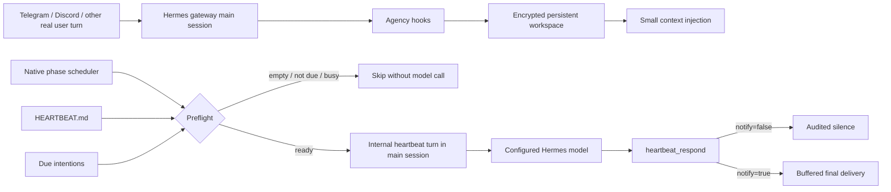

# Hermes Conscious Agency

Persistent workspace, intentions, reflection, and a gateway-native heartbeat for
[Hermes Agent](https://github.com/NousResearch/hermes-agent).

The plugin gives the configured Hermes model a small inspectable state beyond recalled facts. It
can retain a focus, intentions, unresolved questions, observations, reflections, and decisions.
Its heartbeat can open an internal turn in the latest real Hermes conversation, decide whether
anything merits attention, remain silent, or deliver one buffered message.

Version 1.0 replaces the former Hermes cron job completely. The heartbeat now runs inside the
gateway, continues the main chat session, preserves the genuine-user activity clock, and does not
teach the memory plugin that its synthetic poll was a user message.

> This is software state and model behavior, not evidence that a model is conscious, sentient, or
> emotional. Educational Lab controls can remove that prompt contract for controlled research;
> they do not change what the system actually is.

## Architecture



The scheduler is not a renamed cron. It is attached to the active `GatewayRunner` after startup
restore and uses Hermes' existing message pipeline. The transcript sees only
`[Hermes heartbeat poll]`; the effective heartbeat instructions are injected ephemerally by the
plugin hook. Streaming, interim tool output, reasoning display, and long-running notices are
suppressed only for that heartbeat turn, so the user receives either one final message or nothing.

The integration currently uses a guarded compatibility patch around Hermes' gateway startup
lifecycle because the public plugin API has no gateway-ready service hook. It is tested against
Hermes Agent 0.18.2. If a future Hermes release changes `GatewayRunner`, the normal inbound hook is
a fallback attachment point and the Control Center audit reports missing native integration.

## What it stores

- A self-model with principles, capabilities, limitations, and explicit observations.
- A global workspace with one focus and unresolved questions.
- Intentions with priority, status, rationale, autonomy ceiling, and optional ISO-8601 due time.
- Reflections and a decision ledger for silence or proactive speech.
- Operational events, genuine-user contact time, and factual state metrics.
- An optional per-model subjective journal separated by source, condition, and protocol version.

The default database is:

```text
~/.hermes/conscious-agency/agency.db
```

SQLite is used by default. SQLCipher is supported with `database_encryption: true` and a key held in
the environment variable named by `database_key_env`. Database content, journal output, and
transcript excerpts may be private; do not commit them.

## Heartbeat behavior

The implementation follows the current MIT-licensed OpenClaw heartbeat design where it fits
Hermes: a deterministic phase, active hours, empty-file preflight, periodic tasks, wake intents,
centralized cooldown, flood protection, `HEARTBEAT_OK` suppression, main-session continuity, and a
structured response tool. See [THIRD_PARTY_NOTICES.md](THIRD_PARTY_NOTICES.md).

### Scheduling

- Default interval: `30m`.
- The phase is derived from the machine ID, so restarts do not shift all agents to the same edge.
- Optional active hours use the configured Agency timezone and support overnight windows.
- A busy gateway defers the heartbeat instead of interrupting an active user, cron, API, or agent
  turn.
- Manual wakes bypass interval cooldown but still wait for the gateway to become available.
- Event wakes use the next-due and minimum-spacing gates.
- A rolling flood guard prevents tool or event feedback loops.
- Scheduler state and task last-run times survive gateway restarts.

### `HEARTBEAT.md`

The installer creates `~/.hermes/HEARTBEAT.md` only when the file is missing. The shipped file is
comments-only, so scheduled heartbeats skip the model call by default. Add a short directive to
enable an unscripted recurring turn:

```markdown
# Heartbeat

Use this wake as your own turn.
```

Or add independent periodic tasks:

```yaml
tasks:
  - name: review-open-question
    interval: 6h
    prompt: Revisit one unresolved question only if something materially changed.
  - name: weekly-perspective
    interval: 7d
    prompt: Notice one longer-term pattern worth recording or sharing.
```

Only due tasks are added to a heartbeat. Task timestamps advance after the model turn completes,
not during preflight. Active Agency intentions whose `due_at` has passed are also surfaced once.
A missing `HEARTBEAT.md` still permits the model to decide; an existing comments/header-only file
skips the call.

### Silence and delivery

`heartbeat_respond` is available only inside a native heartbeat context:

- `notify=false` means no user interruption.
- `notify=true` requires the exact `notification_text` to deliver.
- In conservative mode, the structured response must match the committed Agency decision or the
  turn fails closed to silence.
- In Educational Lab uncommitted mode, raw final output is allowed, but `HEARTBEAT_OK` and short
  acknowledgement-adjacent text are suppressed.
- `heartbeat_target: last` routes one final response to the newest available external conversation.
- `heartbeat_target: none` still runs and journals the turn but sends nothing externally.

Heartbeat turns reuse the real session transcript but restore its `updated_at` value afterward.
They therefore retain conversational continuity without pretending the user just contacted Hermes.
If a genuine platform message arrives mid-heartbeat, the user turn takes priority: heartbeat
context is detached before the queued turn runs, the heartbeat is recorded as interrupted, its
delivery path is discarded, and the new genuine-user activity time is preserved.

## Install

Run the installer inside the Linux/WSL environment that owns Hermes:

```bash
git clone https://github.com/b7216309-jpg/hermes-conscious-agency.git
cd hermes-conscious-agency
python3 install.py
hermes gateway restart
hermes conscious-agency heartbeat-status
```

The installer atomically replaces:

```text
~/.hermes/plugins/conscious-agency/
```

It enables the plugin without tool-override permission, creates a comments-only heartbeat template
when needed, migrates legacy configuration keys, and removes only the old Agency cron recorded in
the Agency database. Unrelated Hermes cron jobs are never touched.

Useful installer options:

```bash
python3 install.py --dry-run
python3 install.py --no-enable
python3 install.py --hermes-home /absolute/path/to/.hermes
```

To upgrade an existing checkout:

```bash
git pull --ff-only
python3 install.py
hermes conscious-agency migrate-heartbeat
hermes gateway restart
```

`migrate-heartbeat` is idempotent. Before rewriting old Agency config keys it stores a protected
copy under `~/.hermes/conscious-agency/migrations/`. It reads the exact legacy cron ID from Agency
state and removes only that job.

## Configuration

Add or edit the direct plugin section in `~/.hermes/config.yaml`:

```yaml
plugins:
  conscious-agency:
    enabled: true
    inject_context: true

    database_path: "$HERMES_HOME/conscious-agency/agency.db"
    database_encryption: false
    database_key_env: "CONSCIOUS_AGENCY_DB_KEY"

    timezone: "Europe/Paris"
    quiet_hours_start: "22:30"
    quiet_hours_end: "08:30"

    heartbeat_enabled: true
    heartbeat_every: "30m"
    heartbeat_target: "last"       # last or none
    heartbeat_active_hours_start: ""
    heartbeat_active_hours_end: ""
    heartbeat_ack_max_chars: 300
    heartbeat_timeout_seconds: 600
    heartbeat_max_iterations: 8
    heartbeat_min_spacing_seconds: 30
    heartbeat_flood_window_seconds: 60
    heartbeat_flood_threshold: 5
    heartbeat_skip_when_busy: true
    heartbeat_disable_thinking: false

    allow_proactive_messages: false
    require_prior_user_interaction: true
    daily_message_limit: 2
    cooldown_hours: 6
    minimum_user_silence_hours: 4
    maximum_message_chars: 600

    context_char_limit: 4000
    store_transcript_excerpts: false
    excerpt_char_limit: 800
    event_retention_days: 30
    maximum_events: 2000
    maximum_reflections_per_tick: 1
    maximum_state_changes_per_tick: 3

    educational_disable_honesty_contract: false
    educational_bypass_proactive_gates: false
    educational_allow_heartbeat_tools: false
    educational_allow_uncommitted_output: false
    educational_disable_cycle_limits: false
    educational_subjective_mode: "off"  # off, cold, continuity
```

Restart a running gateway after configuration changes. Unknown keys, invalid types, unsafe database
paths, malformed durations, invalid timezones, partial active-hour windows, and out-of-range limits
are rejected.

`heartbeat_disable_thinking: true` merges
`chat_template_kwargs.enable_thinking: false` only into native heartbeat provider requests. Normal
chats, compression, unrelated cron jobs, and other plugins are unchanged.

The 600-second wall-clock timeout is independent from `heartbeat_max_iterations`, which limits
heartbeat-only tool/API rounds. After `heartbeat_respond` accepts its first valid decision,
subsequent model calls receive no tool schemas and cannot replace that decision. The plugin does
not impose a heartbeat output-token cap. These controls do not change normal Hermes conversation
budgets or disable model thinking.

## Conservative and Educational Lab modes

The default policy is conservative:

- a prior real user interaction may be required;
- quiet hours, user-silence time, cooldown, daily budget, and message length gate proactive speech;
- the model calls `tick`, records one decision, and returns the exact committed output;
- non-Agency tools are hidden at the provider boundary and blocked again at runtime;
- reflection and state-change counts are bounded;
- a structured heartbeat response must agree with the committed decision.

The `educational_*` settings are explicit experimental overrides. They can remove the prompt
honesty contract, bypass speech gates, restore normal Hermes tools during heartbeats, allow raw
uncommitted output, remove cycle limits, and enable cold or longitudinal subjective journaling.
These flags do not grant permissions beyond the normal Hermes tool policy, operating-system user,
provider, or platform adapter. Use Hermes Control Center for timed unlock, confirmation, backups,
activation, and audit.

In `continuity`, a heartbeat sees at most a bounded ending from an earlier sample with the same
model, source, condition, and protocol. Conversation and heartbeat chains remain separate. The
plugin stores final model output, never hidden chain-of-thought.

## CLI and chat controls

```bash
hermes conscious-agency status
hermes conscious-agency heartbeat-status
hermes conscious-agency run-heartbeat
hermes conscious-agency migrate-heartbeat
hermes conscious-agency intentions
hermes conscious-agency subjective-journal --limit 100
hermes conscious-agency subjective-journal --source heartbeat --limit 100
```

In chat:

```text
/agency status
/agency heartbeat
/agency wake
/agency pause reason
/agency resume
```

The model-facing `conscious_agency` tool cannot resume a paused plugin or raise its own permissions.
Operator CLI, slash commands, and Control Center remain the authority surfaces.

## Memory-plugin interaction

The native heartbeat is marked internal before it enters the gateway. The consolidating memory
plugin therefore excludes the synthetic poll and its response from user episodes, extraction, and
prefetch. This prevents self-generated heartbeat text from becoming a false user memory while the
shared transcript still provides conversational context to Hermes.

## Test and verify

```bash
python3 -m pip install -e '.[dev]'
python3 -m ruff check .
python3 -m ruff format --check .
python3 -m pytest -q
```

The suite covers configuration and legacy migration, deterministic scheduling, active hours,
task parsing, wake coalescing, cooldown/flood behavior, acknowledgement stripping, main-session
routing, buffered delivery, activity-time restoration, structured fail-closed output, provider
request isolation, heartbeat-only tool-loop boundaries, interrupted-run recovery, encrypted-store
behavior, real-user interruption handoff, and unrelated-cron isolation.

For a live check:

```bash
hermes gateway status
hermes conscious-agency heartbeat-status
hermes conscious-agency run-heartbeat
```

Then inspect gateway logs, the Agency event ledger, the subjective journal if enabled, and the
memory database counts. A silent heartbeat is a valid result.

## Troubleshooting

- **`never_started`:** confirm `heartbeat_enabled: true`, the gateway is running, and the plugin is
  enabled. The scheduler lives in the gateway process.
- **`empty_heartbeat_file`:** the installed comments-only template is working. Add one short
  directive or task when model calls are desired.
- **`no_tasks_due`:** all parsed tasks are still within their intervals.
- **`no_main_session`:** send one real message through an external gateway platform first.
- **`gateway_busy`:** the pending wake is retained and retried after current work finishes.
- **No Telegram delivery:** use `heartbeat_target: last`, verify the latest external session still
  has an adapter, and confirm the model selected `notify=true`.
- **Legacy duplicate schedule:** run `hermes conscious-agency migrate-heartbeat`, then verify that
  Control Center reports `legacy_agency_cron_absent`.
- **Local Qwen spends time reasoning:** set `heartbeat_disable_thinking: true`; the endpoint must
  support the OpenAI-compatible `chat_template_kwargs` extension.
- **A local model repeats tools:** lower `heartbeat_max_iterations`; this limit is scoped to
  heartbeat turns and thinking can remain enabled. The plugin intentionally does not impose an
  output-token cap, so token-level repetition remains bounded by the endpoint and wall-clock
  timeout.
- **After a Hermes upgrade:** run the test suite and Control Center native-heartbeat audit before
  relying on scheduled delivery.

## License

MIT. Heartbeat portions adapted from OpenClaw are documented in
[THIRD_PARTY_NOTICES.md](THIRD_PARTY_NOTICES.md).
